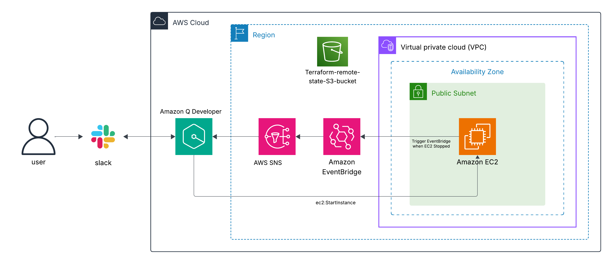

# 💬 Real-Time AWS Operations from Slack (Operational Excellence Pillar)

## 📌 Project Overview

This Terraform-based project showcases cloud operations pipeline that integrates Slack with AWS services using Amazon Q Developer. It demonstrates how alerting can be orchestrated directly from Slack using EventBridge, SNS, and IAM roles with guardrails. While designed as a demo, the architecture reflects real-world best practices for modular, event-driven automation—highlighting the potential of SlackOps workflows in production environments.

---

## 🖼️ Diagram


---

## ✅ Prerequisites

-AWS CLI authenticated to your account
-Terraform ≥ 1.5.0
-Slack workspace with admin access, and a designated channel to receive notifications
-Amazon Q Developer (Chat in Application) enabled in your AWS account
-Amazon Q Developer added to your selected Slack channel
-Verified email address for receiving SNS alerts

---

## 🎯 Key Objectives

- 💬 Trigger EC2 actions (start) from Slack via Amazon Q Developer
- 🔔 Receive EC2 stopped alerts in Slack and email via SNS
- 🧠 Use EventBridge to detect EC2 state changes
- 🔐 Apply IAM guardrails/Roles for chatbot and EC2 execution user role
- 🧠 Store remote state in S3 for reproducibility

---

## 📁 Folder Structure

```
Real-Time-AWS-Operations-From-Slack/
├── Diagram/
│   └── SlackOps-AWS-Automation.png
├── backend.tf
├── main.tf
├── modules/
│   ├── ec2_instance/
│   ├── event_bridge/
│   ├── iam_roles/
│   ├── q_developer/
│   ├── sns_alerting/
├── outputs.tf
├── README.md
├── state-bucket/
│   └── main.tf
├── terraform.tfvars
└── variables.tf
```

---

## 🔁 Real-Time Flow

1. EC2 instance stops
2. EventBridge detects `stopped` state
3. EventBridge sends alert to SNS
4. SNS sends message to:
   - Your email
   - Amazon Q Developer chatbot
5. Chatbot posts alert in Slack

---

## 🚀 Deployment Sequence

### ⚠️ Step 1: Initialize remote state backend

```bash
terraform -chdir=state-bucket init
terraform -chdir=state-bucket plan
terraform -chdir=state-bucket apply -auto-approve
```

### ⚙️ Step 2: Deploy SlackOps infrastructure

```bash
terraform -chdir=Real-Time-AWS-Operations-From-Slack init
terraform -chdir=Real-Time-AWS-Operations-From-Slack plan
terraform -chdir=Real-Time-AWS-Operations-From-Slack apply -auto-approve
```

### ⚙️ Step 3: Teardown Setup

```bash
terraform -chdir=Real-Time-AWS-Operations-From-Slack destroy -auto-approve
terraform -chdir=state-bucket destroy -auto-approve
```

---

## 🧩 Common Errors & Fixes

❌ **Slack Channel Not Receiving Alerts**  
Cause: SNS not linked to channel  
Fix: Go to Q Developer Console → Channel → Link SNS topic manually

❌ **EC2 Not Responding to Slack Commands**  
Cause: IAM role misconfigured  
Fix: Ensure `ec2execution` has correct permissions and is assigned as user role

❌ Error: Missing required argument in Terraform
Cause: A module call is missing a required variable (e.g., vpc_id, subnet_id) 
Fix: Double-check your main.tf and ensure all required inputs are passed to each module.

---

## 🧠 Notes

- Slack channel and Amazon Q Developer configuration must be removed manually via the AWS Console
- SNS subscriptions from Lambda functions does not support must and are not compatible with Q Developer channel wiring.
- Use CloudWatch Events (via EventBridge) for EC2 state detection
- Always destroy main infrastructure before tearing down remote state
- Slack channel must be connected and authorized in Q Developer Console

---

## 🔧 What Could Be Improved

- Add Lambda for auto-remediation (e.g., restart EC2 if stopped)
- Add CloudWatch dashboard for EC2 and EventBridge metrics
- Extend SlackOps to support S3, RDS, or ECS operations
- Integrate CI/CD pipeline for Terraform deployment
- Add Slack buttons or slash commands for EC2 control
